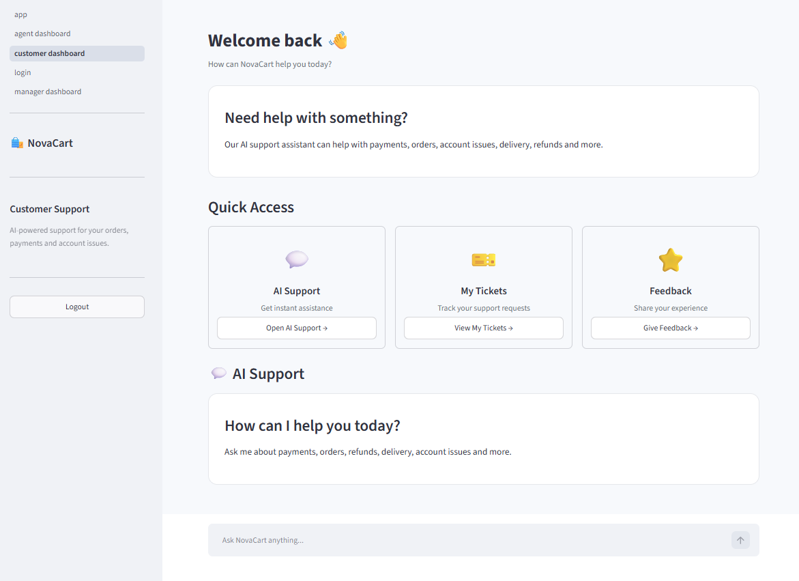
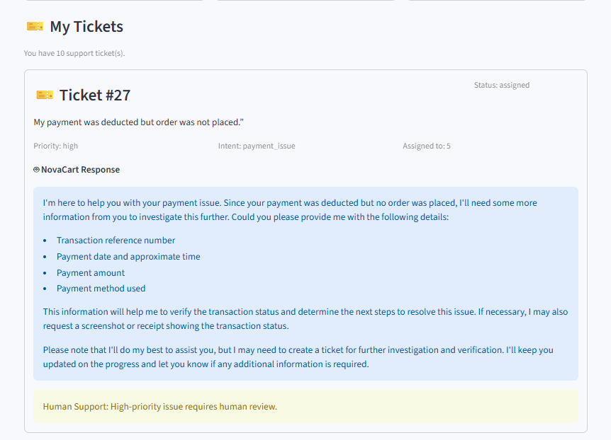
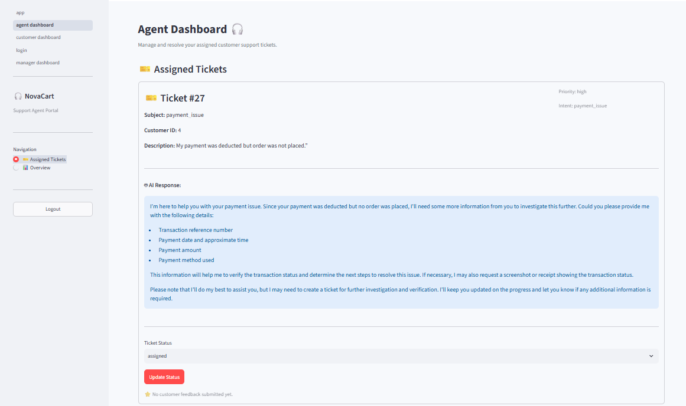
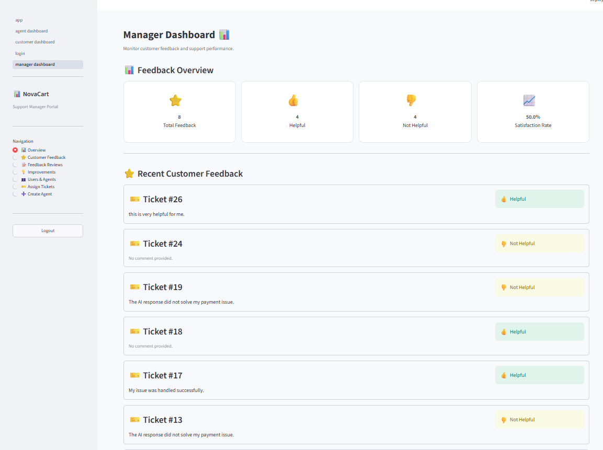
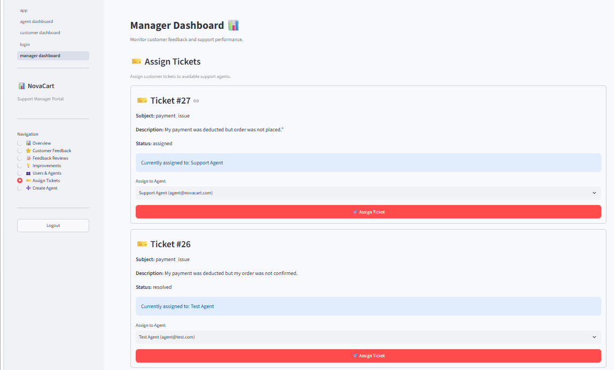
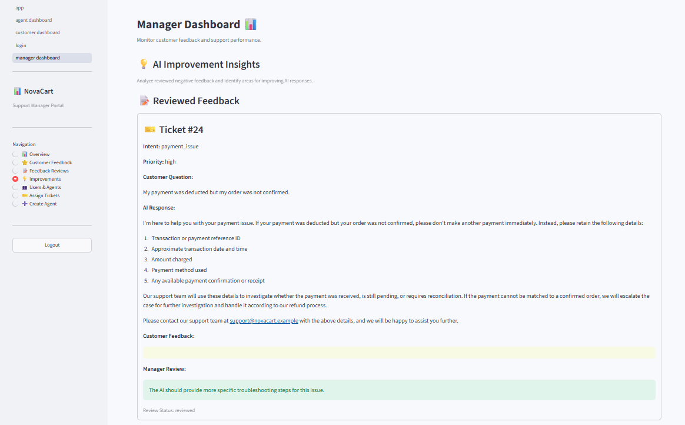

# 🤖 NovaCart — Autonomous Customer Support Copilot

> An AI-powered customer support system that combines **LLM, RAG, intent detection, automated ticket management, workload-based agent assignment, human escalation, and feedback-driven improvement** to provide intelligent customer support.

---

## 📌 Overview

**NovaCart** is an autonomous customer support platform designed to reduce the workload of human support teams by allowing AI to handle common customer queries while automatically creating and managing support tickets for issues that require support intervention.

The system combines:

* 🤖 Large Language Models (LLM)
* 🧠 Intent Detection
* 📚 Retrieval-Augmented Generation (RAG)
* 🎫 Automated Ticket Management
* 👨‍💻 Automatic Agent Assignment
* 🚨 Human Escalation
* ⭐ Customer Feedback
* 📊 Manager Analytics
* 🔄 Feedback-driven AI Improvement

The platform provides separate dashboards for **Customers, Support Agents, and Managers**.

---

# ✨ Key Features

## 🤖 AI Customer Support

Customers can interact with the AI assistant through a conversational interface.

The assistant can handle common queries related to:

* Orders
* Payments
* Refunds
* Delivery
* Account issues
* General support questions

Depending on the query, the system determines whether a support ticket is required.

---

## 🧠 Intent Detection

The system automatically identifies the intent of a customer's message and determines the priority and whether a support ticket is required.

Example:

```text
Customer:
"My payment was deducted but my order was cancelled."

        ↓

Intent Detection

        ↓

Payment Issue
Priority: High
Ticket Required: Yes
```

---

## 📚 Retrieval-Augmented Generation (RAG)

For support-related queries, NovaCart uses a RAG pipeline to retrieve relevant information from the knowledge base before generating an AI response.

### RAG Pipeline

```text
Knowledge Base PDFs
        ↓
Document Loading
        ↓
Text Extraction
        ↓
Text Chunking
        ↓
Embeddings Generation
        ↓
Vector Storage
        ↓
Similarity Search
        ↓
Relevant Context
        ↓
LLM
        ↓
AI Support Response
```

This allows the AI to provide responses based on company-specific knowledge instead of relying only on general LLM knowledge.

---

## 🎫 Automated Ticket Creation

When a customer query requires support, NovaCart automatically creates a support ticket containing:

* Customer
* Subject
* Description
* Intent
* Priority
* AI Response
* Ticket Status
* Assigned Agent
* Escalation Reason

### Ticket Workflow

```text
Customer Query
      ↓
Intent Detection
      ↓
Ticket Required
      ↓
Ticket Created
      ↓
Agent Assigned
      ↓
Agent Resolves Ticket
```

---

## 👨‍💻 Automatic Agent Assignment

NovaCart automatically assigns a new support ticket to the agent with the **lowest number of active tickets**.

Active tickets include:

```text
assigned
in_progress
```

This helps distribute the workload between available support agents.

Managers can also manually assign or reassign tickets to another agent.

---

## 🚨 Human Escalation

NovaCart includes an escalation mechanism that checks whether a customer issue requires human intervention.

The system stores the escalation reason with the support ticket.

Examples of issues that may require escalation include:

* Complex customer issues
* High-priority problems
* Issues requiring human intervention

This allows support agents and managers to identify tickets that need additional attention.

---

## 👨‍💻 Agent Dashboard

Support agents can:

* View assigned tickets
* View customer issues
* View AI-generated responses
* Check ticket priority
* Check detected intent
* Update ticket status
* Resolve tickets
* Close tickets
* View customer feedback

### Ticket Status Workflow

```text
Assigned
   ↓
In Progress
   ↓
Resolved
   ↓
Closed
```

---

## 👔 Manager Dashboard

Managers can monitor and manage the complete support system.

Manager features include:

* 📊 Support overview
* 👥 User management
* 🛠️ Agent management
* 🎫 Ticket management
* 🔄 Ticket reassignment
* ⭐ Customer feedback
* 📝 Feedback reviews
* 💡 AI improvement insights
* 📈 Feedback analytics
* ➕ Create support agents

---

## ⭐ Customer Feedback

After a ticket is resolved, customers can provide feedback about their support experience.

Customers can select:

```text
👍 Helpful
👎 Not Helpful
```

Customers can also provide an optional comment.

---

## 🔄 Feedback-Driven Improvement

Negative customer feedback can be reviewed by managers to identify recurring issues and potential improvements.

The manager dashboard provides:

* Reviewed feedback
* Negative feedback by intent
* Repeated negative-feedback patterns
* AI improvement suggestions

### Feedback Loop

```text
AI Response
     ↓
Customer Feedback
     ↓
Negative Feedback
     ↓
Manager Review
     ↓
Pattern Detection
     ↓
Improvement Suggestion
     ↓
AI / Knowledge Base Improvement
```

---

# 🏗️ System Architecture

```text
                    ┌──────────────────────┐
                    │      Customer        │
                    │    Streamlit UI      │
                    └──────────┬───────────┘
                               │
                               ▼
                    ┌──────────────────────┐
                    │       FastAPI        │
                    │       Backend        │
                    └──────────┬───────────┘
                               │
             ┌─────────────────┼─────────────────┐
             │                 │                 │
             ▼                 ▼                 ▼
      Intent Detection       RAG Pipeline     Ticket System
             │                 │                 │
             │                 ▼                 │
             │          Knowledge Base           │
             │                 │                 │
             │                 ▼                 │
             │                LLM                │
             │                 │                 │
             └─────────────────┼─────────────────┘
                               │
                               ▼
                    ┌──────────────────────┐
                    │     PostgreSQL       │
                    │       Database       │
                    └──────────────────────┘
                               │
                 ┌─────────────┴─────────────┐
                 │                           │
                 ▼                           ▼
        Agent Dashboard              Manager Dashboard
```

---

# 📚 Knowledge Base

The RAG system uses a knowledge base containing relevant company documents.

Recommended structure:

```text
knowledge_base/
│
├── pdfs/
│   └── company_documents.pdf
│
├── processed/
│   └── processed_documents/
│
└── embeddings/
    └── vector_data/
```

### Knowledge Base Processing

```text
PDF Documents
      ↓
Text Extraction
      ↓
Cleaning
      ↓
Chunking
      ↓
Embedding Generation
      ↓
Vector Storage
```

> ⚠️ Private company documents, generated embeddings, API keys, and sensitive data should not be committed to GitHub.

---

# 🛠️ Tech Stack

## Backend

* Python
* FastAPI
* SQLAlchemy
* PostgreSQL
* Pydantic
* JWT Authentication

## AI / ML

* Large Language Models
* Retrieval-Augmented Generation (RAG)
* Embeddings
* Intent Detection
* LLM-based Response Generation

## Frontend

* Streamlit

## Database

* PostgreSQL

## Development Tools

* VS Code
* Git
* GitHub
* Python Virtual Environment

---

# 📁 Project Structure

```text
NovaCart/
│
├── backend/
│   └── app/
│       ├── api/
│       ├── core/
│       ├── db/
│       ├── models/
│       ├── schemas/
│       ├── services/
│       ├── rag/
│       │   ├── rag_service.py
│       │   ├── document_loader.py
│       │   ├── embeddings.py
│       │   └── ...
│       │
│       └── main.py
│
├── frontend/
│   ├── pages/
│   ├── api_client.py
│   ├── config.py
│   └── ...
│
├── knowledge_base/
│   ├── pdfs/
│   ├── processed/
│   └── embeddings/
│
├── screenshots/
│   ├── customer_dashboard.png
│   ├── ai_support.png
│   ├── customer_tickets.png
│   ├── agent_dashboard.png
│   ├── manager_dashboard.png
│   ├── ticket_assignment.png
│   └── feedback_improvements.png
│
├── .env.example
├── .gitignore
├── LICENSE
├── README.md
└── requirements.txt
```

---

# 🖥️ Application Screenshots

## 👤 Customer Dashboard

The customer dashboard provides access to AI support, support tickets, and feedback.



---

## 💬 AI Support

Customers can communicate with the AI support assistant and receive intelligent responses.


---

## 🎫 Customer Tickets

Customers can track their support tickets, status, priority, assigned agent, AI response, and escalation information.



---

## 🎧 Agent Dashboard

Support agents can view and manage tickets assigned to them.



---

## 👔 Manager Dashboard

Managers can monitor users, tickets, feedback, and overall support performance.



---

## 🎯 Ticket Assignment

Managers can manually assign or reassign tickets to support agents.



---

## 💡 Feedback & AI Improvements

Managers can review customer feedback and identify opportunities for improving AI responses.



---

# 🔐 Authentication & Authorization

NovaCart uses role-based access control.

## Customer

Customers can:

* Use AI support
* Create support tickets
* View their own tickets
* Submit feedback

## Agent

Agents can:

* View assigned tickets
* Update ticket status
* Resolve tickets
* Close tickets
* View assigned feedback

## Manager

Managers can:

* View all tickets
* Assign and reassign tickets
* Create support agents
* View all users
* View feedback analytics
* Review negative feedback
* Monitor AI improvement insights

---

# 🚀 Getting Started

## 1. Clone the Repository

```bash
git clone https://github.com/Rupali5253/NovaCart.git
cd NovaCart
```

---

## 2. Create Virtual Environment

```bash
python -m venv venv
```

### Windows

```bash
venv\Scripts\activate
```

---

## 3. Install Dependencies

```bash
pip install -r requirements.txt
```

---

# ⚙️ Environment Variables

Create a `.env` file using `.env.example` as a template.

Example:

```env
DATABASE_HOST=localhost
DATABASE_PORT=5432
DATABASE_NAME=customer_support_db
DATABASE_USER=postgres
DATABASE_PASSWORD=your_password

SECRET_KEY=your_secret_key

GEMINI_API_KEY=your_gemini_api_key
GROQ_API_KEY=your_groq_api_key
```

> Never commit your actual `.env` file or API keys to GitHub.

---

# 🗄️ Database Setup

Make sure PostgreSQL is installed and running.

Create the database:

```text
customer_support_db
```

Then initialize the database using the project's database initialization command.

Example:

```bash
python -m app.db.init_db
```

---

# ▶️ Run Backend

From the backend directory:

```bash
uvicorn app.main:app --reload
```

FastAPI API documentation will be available at:

```text
http://127.0.0.1:8000/docs
```

---

# ▶️ Run Frontend

From the frontend directory:

```bash
streamlit run app.py
```

The Streamlit application will open in your browser.

---

# 🔄 Main Application Workflow

```text
Customer
   │
   ▼
Ask Question
   │
   ▼
Intent Detection
   │
   ├──────────────► General Query
   │                    │
   │                    ▼
   │                  LLM
   │                    │
   │                    ▼
   │                AI Response
   │
   ▼
Support Issue
   │
   ▼
RAG Retrieval
   │
   ▼
Relevant Knowledge
   │
   ▼
LLM Response
   │
   ▼
Ticket Creation
   │
   ▼
Automatic Agent Assignment
   │
   ▼
Agent Dashboard
   │
   ▼
Resolve Ticket
   │
   ▼
Customer Feedback
   │
   ▼
Manager Review
   │
   ▼
Improvement Insights
```

---

# 🧪 Testing

The project was tested through the complete customer-support workflow.

### Tested Scenarios

* User registration
* User login
* Role-based access
* AI support conversation
* Intent detection
* Support ticket creation
* Automatic agent assignment
* Manual ticket reassignment
* Agent ticket management
* Ticket status updates
* Ticket resolution
* Customer feedback
* Manager feedback review
* Feedback analytics
* AI improvement suggestions

---

# 🔒 Security

The project follows basic security practices including:

* JWT-based authentication
* Role-based authorization
* Environment variables for secrets
* API key protection
* Password authentication
* Protected manager and agent endpoints

Sensitive configuration files should never be committed to the repository.

---

# 📌 Future Improvements

Potential future enhancements include:

* 🌍 Multi-language support
* 🎙️ Voice-based customer support
* 📱 WhatsApp integration
* 📧 Email support integration
* 📎 Screenshot and file upload for support issues
* 🔔 Real-time notifications
* 📊 Advanced support analytics
* 🧠 Improved agent workload balancing
* 🔍 Better knowledge-base management
* 📝 Persistent conversation history
* 🔄 Automated knowledge-base updates
* 📈 SLA monitoring
* ⭐ Advanced customer satisfaction metrics

---

# 🎯 Project Goals

NovaCart aims to:

* Reduce repetitive customer-support workload
* Provide faster customer responses
* Automate support-ticket creation
* Improve agent workload distribution
* Escalate complex issues to human agents
* Learn from customer feedback
* Improve support quality over time

---

# 👩‍💻 Author

**Rupali Rathore**

Data Science | AI/ML | Data Analytics

---

# 📄 License

This project is licensed under the MIT License.

See the `LICENSE` file for details.
